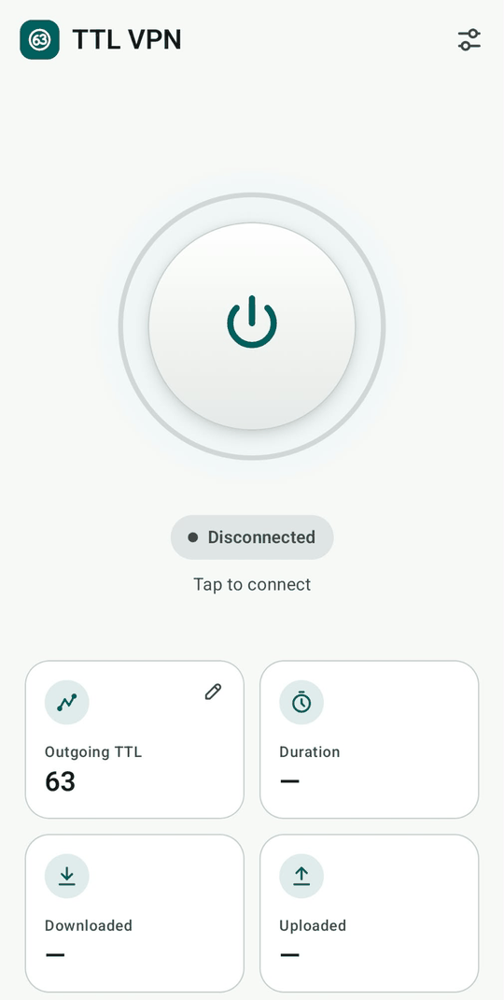
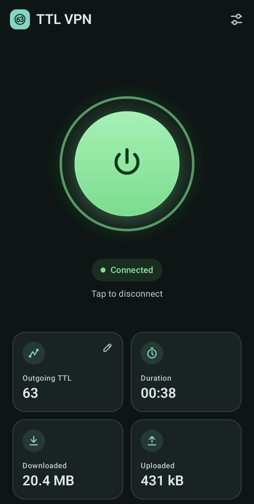
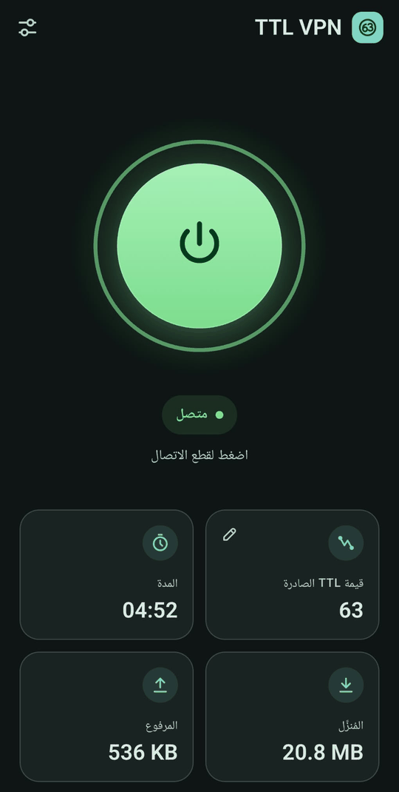
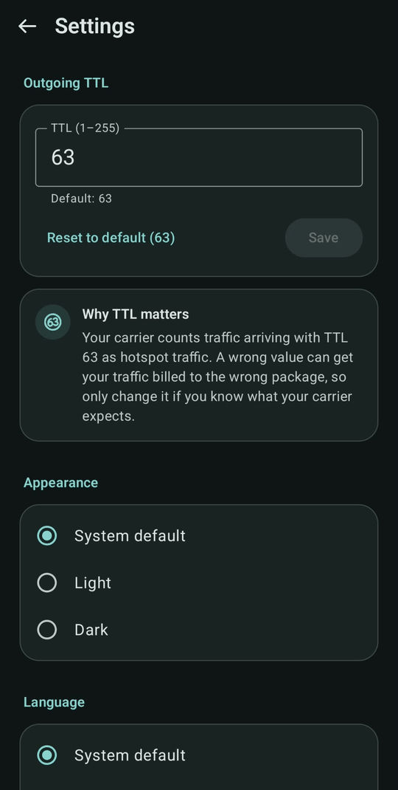
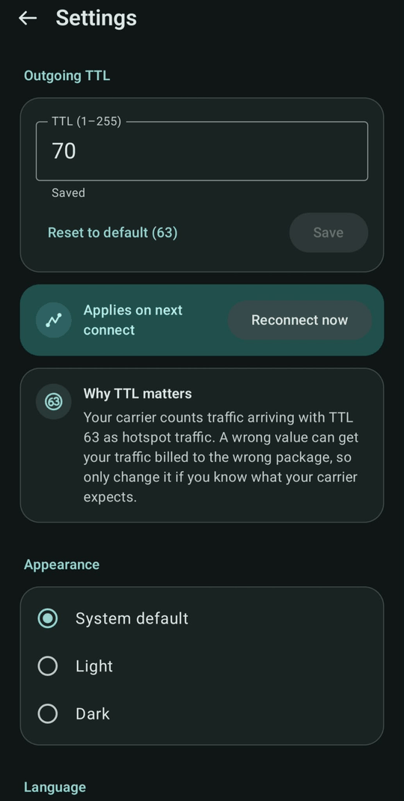
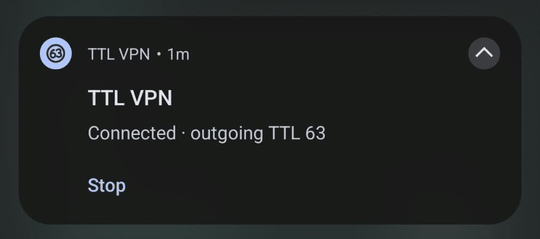
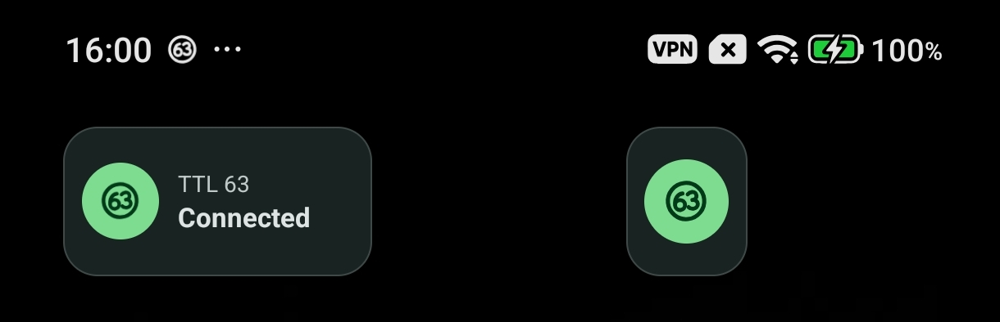

# TTL VPN

An Android app that makes your phone's internet traffic leave with a TTL of **63**, so a
carrier that tells hotspot traffic apart by TTL bills it to the hotspot package you paid for.

Android 7.0 or newer, 64-bit ARM phones (arm64). English, Türkçe and العربية.

- [TTL VPN](#ttl-vpn)
  - [The problem it solves](#the-problem-it-solves)
  - [What it is not](#what-it-is-not)
  - [Disclaimer](#disclaimer)
  - [Features](#features)
  - [Screenshots](#screenshots)
  - [Installing on a phone](#installing-on-a-phone)
  - [Laptops](#laptops)
  - [How it works](#how-it-works)
  - [Building from source](#building-from-source)
    - [Prerequisites](#prerequisites)
    - [build.bat](#buildbat)
    - [Manual commands](#manual-commands)
    - [Troubleshooting](#troubleshooting)
  - [Releasing](#releasing)
  - [Project structure](#project-structure)
  - [Limitations](#limitations)
  - [License](#license)
  - [Author](#author)

## The problem it solves

**In plain language.** Your phone (running TTL VPN) connects to the Wi-Fi hotspot of a second
device that holds the SIM with the hotspot package, but that device forwards traffic without
lowering its TTL. Every internet packet carries a small number called the TTL, and the carrier
uses it to decide whether traffic comes from the hotspot device itself or from something
connected to it. Because your phone's packets arrive looking like the hotspot device's own
traffic, they're billed to the wrong package. TTL VPN changes that number on your phone, so
your traffic arrives the way real hotspot traffic does and is counted against the hotspot
package.

**Technically.** The TTL (Time To Live, called *hop limit* in IPv6) is a field in every IP
packet. Each router that forwards a packet lowers it by one. Android sends packets with TTL 64.
A hotspot device that routes normally lowers it to 63 on the way out, and carriers can use that
difference to recognize tethered traffic. Some devices, such as basic feature phones with a
hotspot function, forward without lowering it, so the carrier sees 64 and treats the traffic
as the hotspot device's own. TTL VPN sends your phone's traffic out with TTL 63 to begin with.
The value is configurable (1–255, default 63), since what a carrier expects can differ.

## What it is not

- **Not a privacy or security VPN.** It doesn't encrypt anything, doesn't hide your IP address
  and doesn't route your traffic through any server. Android calls any app that handles the
  phone's traffic locally a "VPN", which is why you'll see the key icon in the status bar.
- **No remote server.** All processing happens on your phone; your traffic goes to the same
  places it would go without the app.
- **DNS:** while connected, DNS lookups go to Cloudflare (1.1.1.1) and Google (8.8.8.8) instead
  of the carrier's DNS servers.

## Disclaimer

TTL VPN is intended for traffic that really is hotspot traffic, billed to a hotspot package you
have paid for. You are responsible for complying with your carrier's terms of service. The TTL
is user-configurable; using it to misrepresent traffic to a carrier is not the intended use.
The software is provided without any warranty; see the [license](#license).

## Features

- **Home screen:** one large toggle with the current state (Disconnected, Connecting, Connected,
  or Not connected with the reason), the outgoing TTL, the session duration, and data downloaded and uploaded
  during the session. Tapping the TTL tile opens Settings.
- **Settings**
  - **Outgoing TTL** (1–255) with validation, *Reset to default (63)*, and an explanation. If
    you change it while connected, *Reconnect now* applies the new value immediately.
  - **Appearance:** System default, Light or Dark.
  - **Language:** System default, English, Türkçe or العربية, with full right-to-left layout in
    Arabic. Numbers always use Latin digits (0–9). On Android 13+ the choice also appears in the
    system's per-app language settings.
  - **Quick Settings:** an *Add tile* button (Android 13+).
  - **About:** version, author, GitHub link, and the open source licenses.
- **Quick Settings tile:** turns the VPN on and off and shows its state, e.g. "Connected · TTL 63".
  On the lock screen, turning it on works directly; turning it off asks you to unlock first.
- **Home screen widget:** a 1×1 and a 2×1 size. One tap toggles the VPN; the widget shows the
  state in the app's status colors and follows the phone's light/dark mode. If the VPN
  permission is missing, tapping it opens the app.
- **Notification** while the VPN is active, with the current state and a *Stop* button.

## Screenshots

<table>
  <tr>
    <td align="center"><br><sub>Disconnected · light theme</sub></td>
    <td align="center"><br><sub>Connected · dark theme</sub></td>
    <td align="center"><br><sub>Arabic, right-to-left</sub></td>
  </tr>
  <tr>
    <td align="center"><br><sub>Settings</sub></td>
    <td align="center"><br><sub>New TTL while connected</sub></td>
  </tr>
</table>

<p>
  <br>
  <sub>Notification with the Stop button</sub>
</p>

<p>
  <br>
  <sub>Home screen widgets, 2×1 and 1×1</sub>
</p>

<p>
  <br>
  <sub>Quick Settings tile</sub>
</p>

## Installing on a phone

**Requirements:** Android 7.0 (API 24) or newer, on a 64-bit ARM phone. The APK contains native
code for `arm64-v8a` only, so it won't install on 32-bit-only (`armeabi-v7a`) or x86 devices;
Android rejects it as not compatible.

1. **Download** the latest `.apk` from the
   [Releases page](https://github.com/MalikFikret/ttl-vpn/releases).
2. **Verify it** (recommended): compare the file's SHA-256 checksum with the one published in the
   release. On Windows, in PowerShell:

   ```powershell
   Get-FileHash .\TTL-VPN-1.0.0.apk -Algorithm SHA256
   ```

   (or `certutil -hashfile TTL-VPN-1.0.0.apk SHA256` in CMD; `sha256sum TTL-VPN-1.0.0.apk` on
   Linux/macOS). Use your file's actual name. If the values differ, don't install it.

   Every release is signed with the same key. Its signing certificate SHA-256 is:

   ```
   SIGNING-CERTIFICATE-SHA-256-PLACEHOLDER
   ```

   With the Android SDK you can check it: `apksigner verify --print-certs TTL-VPN-1.0.0.apk`
   shows it as `Signer #1 certificate SHA-256 digest`.
3. **Allow the install:** when you open the APK, Android asks to allow your browser or file
   manager to *install unknown apps*. Allow it for that app only.
4. **First run:**
   - On Android 13+, the app asks for permission to show notifications. Allow it, so you can
     see that the VPN is active and stop it from the notification.
   - Tap the big button. Android shows a *Connection request* for the VPN; tap **OK**. This is
     asked once.
5. **Optional:** add the Quick Settings tile (Settings → *Add tile*, or edit your Quick Settings
   panel) and the widget (long-press the home screen → Widgets → TTL VPN).

**Updating:** install the new APK over the old one. Your settings (TTL, theme, language) are
kept. They are deliberately not included in Android backups or device-to-device transfers, so a
new phone starts with the defaults.

**Xiaomi / HyperOS / MIUI, only if the VPN stops on its own in the background:** open the app's
system settings, set *Battery saver* to *No restrictions* and turn on *Autostart*. This is
general advice for these systems; the app runs as a foreground service with a notification,
which usually keeps it alive.

## Laptops

TTL VPN can't help a laptop connected to the same hotspot. On Windows, the same fix is changing
the system's default TTL. In a terminal **run as Administrator**:

```cmd
netsh int ipv4 set glob defaultcurhoplimit=63
netsh int ipv6 set glob defaultcurhoplimit=63
```

To restore the Windows default:

```cmd
netsh int ipv4 set glob defaultcurhoplimit=128
netsh int ipv6 set glob defaultcurhoplimit=128
```

This applies to **all networks** (Wi-Fi, Ethernet, everything) until you restore it.

## How it works

```
  Apps on the phone
        |  all IPv4 traffic (IPv6 is blocked, see below)
        v
  Android VpnService: TUN interface 10.111.0.2/32, route 0.0.0.0/0,
        |              DNS 1.1.1.1 / 8.8.8.8
        |  the TUN file descriptor is handed to the engine
        v
  tun2socks engine (Go, compiled with gomobile into an AAR), "direct" mode:
        |  terminates each TCP/UDP flow and re-opens it from the app's own sockets
        v
  Real sockets with IP_TTL = 63 (IPV6_UNICAST_HOPS on IPv6 sockets)
        |  the app excludes itself from its own VPN, so these sockets bypass the TUN
        v
  Wi-Fi  ->  hotspot device  ->  carrier
```

The TTL isn't rewritten in captured packets. The engine creates a new connection for every flow
and sets the TTL as a socket option on it, which Android allows any app to do without root.

Key design decisions (the details live in [`docs/ARCHITECTURE.md`](docs/ARCHITECTURE.md)):

- **IPv4 only, on purpose.** The TUN gets no IPv6 address, route or DNS server, so Android
  blocks all IPv6 while connected. Advertising IPv6 made apps prefer it, but on an IPv4-only
  hotspot the engine couldn't reach IPv6 destinations and reset those connections. Blocking it
  makes apps fall back to IPv4, and nothing leaks out with the default hop limit.
- **No routing loop:** the app excludes itself from the VPN (`addDisallowedApplication`), so the
  engine's own sockets go straight to the network.
- **fd ownership:** after `detachFd()` the Go engine owns the TUN file descriptor and closes it
  on stop. Only if the engine fails to start does the app close it itself.
- **One engine thread:** every start, stop, revoke and shutdown runs on a single process-wide
  thread, strictly in order. Double taps, a Stop during a start, or the service being destroyed
  mid-start can't leave the engine running or leak the file descriptor.
- **The engine validates its input** before starting, because tun2socks would otherwise kill the
  whole app on bad configuration.
- **One on/off path:** the app, the tile and the widget all go through `VpnController`, which
  only sends start/stop requests to the service.
- **Localization:** per-app language without extra libraries (system `LocaleManager` on Android
  13+). All numbers are formatted in one place, with Latin digits and wrapped so they read left
  to right inside Arabic text.

## Building from source

The development setup is Windows with Android Studio. `build.bat` is Windows-only; on macOS or
Linux, the [manual commands](#manual-commands) translate directly, but that setup is untested.

### Prerequisites

| Tool | Version used | Notes |
|---|---|---|
| Go | 1.27.1 | Minimum set by `engine/go.mod` |
| gomobile + gobind | x/mobile `v0.0.0-20260908204917-8b95e45f8d3e` | Same version as `engine/go.mod` |
| Android Studio | current | Provides the SDK, the NDK and a JDK (JBR) |
| Android SDK | platform 37 | compileSdk/targetSdk 37, minSdk 24 |
| Android NDK | r30 (30.0.16248370) | SDK Manager → SDK Tools → *NDK (Side by side)* |
| JDK | 17 or newer | Android Studio's bundled `jbr` folder works |
| Gradle | 9.6.0 | Included as the wrapper (`android/gradlew.bat`) |
| Python 3 | any recent | Only for `tools/update_licenses.py` |

Install gomobile and gobind (they end up in Go's bin folder, `go env GOPATH` + `\bin`, which
must be on `PATH`):

```cmd
go install golang.org/x/mobile/cmd/gomobile@v0.0.0-20260908204917-8b95e45f8d3e
go install golang.org/x/mobile/cmd/gobind@v0.0.0-20260908204917-8b95e45f8d3e
```

Environment variables:

| Variable | Example | Required |
|---|---|---|
| `JAVA_HOME` | `C:\Program Files\Android\Android Studio\jbr` | Yes. Gradle uses this JDK, not `java` on `PATH` |
| `ANDROID_HOME` | `%LOCALAPPDATA%\Android\Sdk` | Yes (`ANDROID_SDK_ROOT` also works) |
| `ANDROID_NDK_HOME` | `%ANDROID_HOME%\ndk\30.0.16248370` | Recommended; otherwise the newest folder in `%ANDROID_HOME%\ndk` is used |

The first Gradle build downloads a JDK 25 for the Gradle daemon (set in
`android/gradle/gradle-daemon-jvm.properties`), so it needs internet access.

### build.bat

From any directory:

```cmd
build.bat           :: build the Go engine, then the debug APK
build.bat install   :: same, then install it on the USB-connected phone (adb)
build.bat app       :: skip the engine, reuse engine\build\ttlvpn.aar
build.bat release   :: signed release APK, see Releasing
build.bat help
```

It checks every prerequisite first and stops with a clear message, and for `install` it checks
the phone *before* spending minutes on a build. The APK ends up in
`android\app\build\outputs\apk\debug\app-debug.apk`; the script prints the full path.

For `install`, enable *USB debugging* on the phone (Developer options) and accept the prompt
when you connect it. With several devices connected, set `ANDROID_SERIAL` to choose one.

Debug builds install **next to** the release app, not over it: the package is
`com.malikfikret.ttlvpn.debug`, the version ends in `-debug`, and the launcher, VPN dialog, Quick
Settings tile and widget picker say **TTL VPN (debug)**. The two keep separate settings.

### Manual commands

Engine, from `engine\` in CMD:

```cmd
mkdir build
gomobile bind -target=android/arm64 -androidapi 24 -trimpath -ldflags="-s -w" -o build\ttlvpn.aar ./ttlvpn
```

- `-trimpath` records module-relative source paths, so no local path or Windows user name ends
  up in the APK.
- `-ldflags="-s -w"` strips the symbol table and debug info: about half the size of the native
  library. Go panic traces still show function names and file:line.
- Only arm64 is built. Add `android/amd64` to `-target` to run on an x86_64 emulator.

App, from `android\`:

```cmd
gradlew.bat assembleDebug
gradlew.bat installDebug
gradlew.bat test
```

Checking the engine's Linux-only TTL code from Windows (CMD, in `engine\`; no space before
`&&`, or CMD includes it in the value):

```cmd
set GOOS=linux&& set GOARCH=arm64&& go vet ./...
set GOOS=
set GOARCH=
```

### Troubleshooting

| Message from build.bat | Fix |
|---|---|
| `JAVA_HOME is not set` | Point `JAVA_HOME` to a JDK 17+, e.g. Android Studio's `jbr` folder |
| `JAVA_HOME is not a JDK: no bin\javac.exe in ...` | It points to a JRE or a wrong folder. An old Java 8 first on `PATH` doesn't matter; only `JAVA_HOME` does |
| `No Android NDK found` | Install *NDK (Side by side)* in the SDK Manager, or set `ANDROID_NDK_HOME` |
| `ANDROID_NDK_HOME is not an NDK folder` | It must be the versioned folder containing `source.properties` |
| `gomobile not found on PATH` / `gobind not found on PATH` | Install both (see above) and add Go's bin folder to `PATH`; reopen the terminal |
| `ANDROID_HOME is not set` | Set it to the SDK folder shown in Android Studio → Settings → Languages & Frameworks → Android SDK |
| `No device connected` / `not authorized` | Enable USB debugging, unlock the phone, accept the prompt; check with `adb devices` |
| `Engine AAR not found` (with `app`) | Run `build.bat` once without `app` to build the engine |

**After any dependency change** (Go module bump, Gradle dependency, rebuilt engine), regenerate the
in-app license notices:

```cmd
python tools\update_licenses.py
```

It fails if a newly added Android library isn't listed yet; add it to the table in the script.

## Releasing

Releases are signed APKs built on Windows with `build.bat release`. They're `arm64-v8a` only and
need Android 7.0 (API 24) or newer; say so in the release notes.

**One-time: the release keystore**

- Create it **outside the repo** (the build refuses a keystore or properties file inside it).
  `keytool` comes with the JDK and prompts for the password, so it doesn't end up in your shell
  history:

  ```cmd
  "%JAVA_HOME%\bin\keytool" -genkeypair -v -keystore C:\path\outside\repo\ttl-vpn-release.jks -alias ttlvpn -keyalg RSA -keysize 4096 -validity 10000
  ```

  The keystore is PKCS12 (keytool's default), which uses one password for the store and the key.
- **Back it up** in at least two places, along with its password. Losing either means users
  can't update: Android refuses an update signed with a different key, so they would have to
  uninstall first and lose their settings.

**Telling the build where the key is.** Either way, Gradle reads the values itself: `build.bat`
never touches them, nothing prints them, and none of them is stored in the repo.

- **Recommended:** copy [`android/keystore.properties.example`](android/keystore.properties.example)
  **outside the repo** (for example next to the keystore), fill it in, and point
  `TTLVPN_KEYSTORE_PROPERTIES` at it. `setx` applies to terminals opened afterwards:

  ```cmd
  setx TTLVPN_KEYSTORE_PROPERTIES C:\path\outside\repo\keystore.properties
  ```

- **Or** set `TTLVPN_KEYSTORE` (keystore path), `TTLVPN_KEYSTORE_PASSWORD`, `TTLVPN_KEY_ALIAS`
  and, only if it differs from the store password, `TTLVPN_KEY_PASSWORD`. Don't combine this
  with `TTLVPN_KEYSTORE_PROPERTIES`; the build stops if both are set.

If anything is missing or wrong, release builds fail with a message saying what. There is no
fallback to the debug key. Debug builds don't need any of this.

**Each release**

1. Bump `versionCode` (+1) and `versionName` in `android/app/build.gradle.kts`. If any
   dependency changed, re-run `tools/update_licenses.py`.
2. Run `build.bat release`. It builds the engine and the release APK (R8 shrinking on), verifies
   the signature with `apksigner` (and fails if the APK is debug-signed), copies the APK to
   `dist\TTL-VPN-<version>.apk`, and prints:
   - **APK SHA-256:** goes in the release notes.
   - **Signing certificate SHA-256:** the same for every release signed with this key; it goes
     in [Installing on a phone](#installing-on-a-phone).
3. Install it on the phone and test it before publishing: only the release build is shrunk by
   R8, so a missing keep rule shows up only there.
4. Tag the commit (`git tag v1.0.0`, then push the tag), create a GitHub Release from it, attach
   the APK, and put its SHA-256 and the requirements in the release notes.

## Project structure

```
build.bat                  One-step build (engine + APK), Windows
LICENSE                    GPL-3.0
docs/ARCHITECTURE.md       Architecture, invariants and design decisions (the detailed reference)
docs/screenshots/          README images
dist/                      Release APKs from build.bat release (gitignored)
tools/update_licenses.py   Regenerates the in-app open source notices
engine/                    Go engine (module github.com/MalikFikret/ttl-vpn/engine)
  ttlvpn/ttlvpn.go         Start(fd, mtu, ttl) / Stop() exposed to Android via gomobile
  ttlvpn/ttl_linux.go      Sets IP_TTL / IPV6_UNICAST_HOPS on every outbound socket
  ttlvpn/ttl_others.go     Stub so the package compiles on Windows
android/keystore.properties.example   Template for the release signing properties
android/app/build.gradle.kts           Versions, release signing, R8, debug suffix
android/app/src/main/
  keepRules/rules.keep     R8 keep rules (gomobile classes, no obfuscation)
  java/com/malikfikret/ttlvpn/
    TtlVpnService.kt       VpnService: TUN setup, engine thread, notification, state
    VpnController.kt       The single on/off path for app, tile and widget
    VpnState.kt            State model (StateFlow)
    TtlTileService.kt      Quick Settings tile
    TtlWidgetProvider.kt   Home screen widget (+ WidgetToggleReceiver.kt)
    AppSettings.kt         DataStore: TTL, theme, language, tile flag
    AppLanguage.kt         Per-app language (Android 7+)
    Formatting.kt          All number formatting (Latin digits, LTR)
    MainActivity.kt        Screens, permissions, theme
    ui/                    Compose screens: home, settings, licenses, theme
  res/                     Strings (values, values-tr, values-ar), icons, widget layouts
```

## Limitations

- **arm64 phones only.** The engine is built for 64-bit ARM, which covers practically all
  current phones, but not x86_64 emulators (see the build notes to add one).
- **IPv4 only while connected.** IPv6 is deliberately blocked; a site reachable only over IPv6
  won't load.
- **Carrier-specific.** TTL 63 works for the carrier and hotspot device this was built for.
  Other carriers may expect a different value or detect tethering in other ways; the TTL is
  configurable for that reason, but there's no guarantee.
- **DNS servers are fixed** to 1.1.1.1 and 8.8.8.8 and can't be changed in the app.
- **Data usage** counts everything the engine sends and receives, including protocol overhead,
  so it can read slightly higher than the size of what you loaded.

## License

TTL VPN is free software, licensed under the [GNU General Public License v3.0](LICENSE).

It bundles open source components under the MIT, BSD and Apache-2.0 licenses (including
[tun2socks](https://github.com/xjasonlyu/tun2socks), gVisor, the Go standard library, AndroidX
and Kotlin). Their notices are in the app under **Settings → About → Open source licenses**,
generated from the actual dependencies by [`tools/update_licenses.py`](tools/update_licenses.py).

## Author

**Malik Fikret**: [github.com/MalikFikret](https://github.com/MalikFikret)
